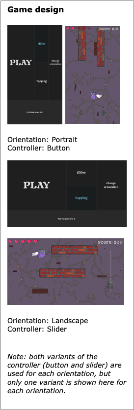

# Touch Gestures and Screen Orientation in Mobile Endless Runner Games

## This repository contains the code for the minigame developped using Godot for the project

## Institution
Utrecht University, Utrecht, The Netherlands

## Abstract
This study investigates the impact of button and slider touch gestures on player performance and user experience in mobile endless runner games, across portrait and landscape screen orientations. The game was developed using Godot and tested with 15 participants. Results showed buttons improved performance over sliders, but neither input method affected user experience. Orientation had no effect on either performance or experience.

## Keywords
- Mobile gaming
- Human computer interaction (HCI)
- Touch gestures
- Screen orientation
